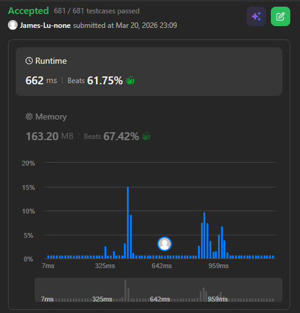

```c++
class Solution {
    struct Pair {
        int64_t sum;
        int left;
        // add simple constructor
        Pair(int64_t s, int l): sum(s), left(l) {}
        bool operator>(const Pair& other) const {
            if (sum != other.sum) return sum > other.sum;
            return left > other.left;
        }
    };

public:
    int minimumPairRemoval(vector<int>& nums) {
        int n = nums.size();
        if (n <= 1) return 0;

        vector<int64_t> val(n);
        vector<int> L(n), R(n);
        vector<bool> removed(n, false);
        priority_queue<Pair, vector<Pair>, greater<Pair>> pq;
        
        int unsorted_count = 0;
        for (int i = 0; i < n; ++i) {
            val[i] = nums[i];
            L[i] = i - 1;
            R[i] = i + 1;
            if (i < n - 1) {
                // emplace() is preferred for objects to prevent temporary object
                pq.emplace((int64_t) nums[i] + nums[i + 1], i);
                if (nums[i] > nums[i + 1]) unsorted_count++;
            }
        }
        R[n - 1] = -1;

        int ops = 0;
        // printf("unsorted_count: %d\n", unsorted_count);
        while (unsorted_count > 0 && !pq.empty()) {
            Pair top = pq.top();
            pq.pop();
            int i = top.left;
            int j = R[i];
            // printf("checking pair (%d, %d) with sum %d... ", i, j, top.sum);
            if (j != -1 && !removed[i] && !removed[j] && (val[i] + val[j] == top.sum)) {
                // printf("valid pair\n");
                if (L[i] != -1 && val[L[i]] > val[i]) unsorted_count--;
                if (val[i] > val[j]) unsorted_count--;
                if (R[j] != -1 && val[j] > val[R[j]]) unsorted_count--;

                val[i] += val[j];
                removed[j] = true;
                int j_next = R[j];
                R[i] = j_next;
                if (j_next != -1) L[j_next] = i;

                if (L[i] != -1 && val[L[i]] > val[i]) unsorted_count++;
                if (R[i] != -1 && val[i] > val[R[i]]) unsorted_count++;

                ops++;
                // emplace() is preferred for objects to prevent temporary object
                if (L[i] != -1) pq.emplace(val[L[i]] + val[i], L[i]);
                if (R[i] != -1) pq.emplace(val[i] + val[R[i]], i);
            } else {
                // printf("invalid pair\n");
            }
        }

        return ops;
    }
};
// Below approach reports TLE or MLE
// class Solution {
//     // for adjacent number pair (i,j) after operation, the elements originally located at i−1 and j+1 will form two new adjacent number pairs with the newly merged element.
//     struct Pair {
//         int64_t sum;
//         int left;
//         // define operator ">" for pq greater
//         bool operator>(const Pair& other) const {
//             if (sum != other.sum) return sum > other.sum;
//             // if sum == other.sum then choose the leftmost one
//             return left > other.left;
//         }
//     };
// public:
//     int minimumPairRemoval(vector<int>& nums) {
//         int n = nums.size();
//         if (n <= 1) return 0;
//         vector<int64_t> val(n);
//         vector<int> L(n), R(n);
//         // vector<Pair>: uses vector to store complete binary tree (default)
//         // greater<Pair>: build a Min-Heap: smallest value will have highest priority, operator> defines what is greater 
//         priority_queue<Pair, vector<Pair>, greater<Pair>> pq;
        
//         // uses L, R to simulate doubly linked list
//         // L: {-1, 0, 1, 2, 3, ... , n-3, n-2}
//         // R: { 1, 2, 3, 4, 5, ... , n-1, n}, last element changed to -1 since there's no element on the right for nums[n-1]
//         for (int i = 0; i < n; ++i) {
//             val[i] = nums[i];
//             L[i] = i-1;
//             R[i] = i+1;
//             if (i < n - 1) {
//                 pq.push({(int64_t) nums[i] + nums[i+1], i});
//             }
//         }
//         R[n-1] = -1;

//         int ops = 0;
//         vector<bool> removed(n, false);

//         while (!checkSorted(val, R)) {
//             while (!pq.empty()) {
//                 Pair top = pq.top();
//                 pq.pop();
//                 int i = top.left;
//                 int j = R[i];
//                 // printf("checking pair (%d, %d) with sum %d... ", i, j, top.sum);
//                 // check pair (i,R[i]) that has highest priority
//                 if (j != -1 && !removed[i] && !removed[j] && (val[i] + val[j] == top.sum)) {
//                     // printf("valid pair\n");
//                     val[i] += val[j];
//                     removed[j] = true;
                    
//                     // update doubly linked list
//                     int j_next = R[j];
//                     R[i] = j_next;
//                     if (j_next != -1) L[j_next] = i;

//                     // push two new possible pair if not at edge
//                     if (L[i] != -1) {
//                         pq.push({val[L[i]] + val[i], L[i]});
//                         // printf("pair with value %d pushed with left index %d\n", val[L[i]] + val[i], L[i]);
//                     }
//                     if (R[i] != -1) {
//                         pq.push({val[i] + val[R[i]], i});
//                         // printf("pair with value %d pushed with left index %d\n", val[i] + val[R[i]], i);
//                     }

//                     ops++;
//                     break;
//                 } else {
//                     // printf("invalid pair\n");
//                 }
//             }
//         }

//         return ops;
//     }
//     bool checkSorted(vector<int64_t>& val, vector<int>& R) {
//         int i = 0;
//         while (R[i] != -1) {
//             int next = R[i];
//             if (val[i] > val[next]) return false;
//             i = next;
//         }
//         return true;
//     }
// };
```
