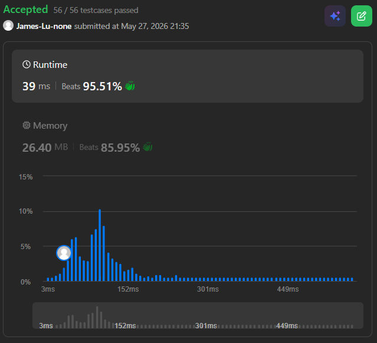

```c++
class Solution {
public:
    bool canCross(vector<int>& stones) {
        // problem: determine if the frog is able to cross the river by landing on the last stone.
        // subproblem: dp[i][k] represents whether the frog can reach stone i and is allowed to make a next jump of size k.
        // Base case:
        // The frog starts at stone 0. Its first jump must be of size 1 to reach stone 1 (if stone 1 exists at position 1).
        // So we initialize dp[0][1] = true, meaning from stone 0, a jump of size 1 is valid.
        // Time complexity: O(N^2) where N is the number of stones.
        // Space complexity: O(N^2) for the DP table.

        int n = stones.size();
        // dp[i][j] means if we can reach stone i with a jump of size j
        vector<vector<bool>> dp(n, vector<bool>(n+1,false));
        // base case: at stone 0, we can make a jump of size 1 to reach stone 1
        dp[0][1] = true;
        
        for(int i = 1; i < n; ++i){
            for(int j = 0; j < i; ++j){
                int diff = stones[i] - stones[j];
                // if the distance is too large or we couldn't reach stone j with a jump of size diff
                if(diff < 0 || diff > n || !dp[j][diff]) continue;
                
                // if we can reach stone i from stone j with jump diff,
                // then from stone i we can jump diff-1, diff, or diff+1 next
                dp[i][diff] = true;
                if(diff - 1 >= 0) dp[i][diff - 1] = true;
                if(diff + 1 <= n) dp[i][diff + 1] = true;
                
                // if we reached the last stone, we are done
                if(i == n - 1) return true;
            }
        }

        return false;
    }
};
```
