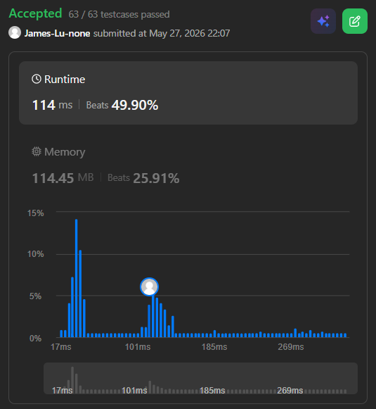

```c++
class Solution {
public:

    int removeBoxes(vector<int>& boxes) {
        int n = boxes.size();
        vector<vector<vector<int>>> dp(n,vector<vector<int>>(n,vector<int>(n)));
        return removeBoxesSub(boxes, 0, n - 1, 0, dp);
    }

    int removeBoxesSub(vector<int>& boxes, int i, int j, int k,  vector<vector<vector<int>>>& dp) {
        if (i > j) return 0;
        if (dp[i][j][k] > 0) return dp[i][j][k];
        
        // Need to record the intial values of i and k in order to apply the following optimization
        int i0 = i;
        int k0 = k;
        // optimization: all boxes of the same color counted continuously from the first box should be grouped together
        for (; i + 1 <= j && boxes[i + 1] == boxes[i]; i++, k++); 
        int res = (k + 1) * (k + 1) + removeBoxesSub(boxes, i + 1, j, 0, dp);
        
        for (int m = i + 1; m <= j; m++) {
            if (boxes[i] == boxes[m]) {
                res = max(res, removeBoxesSub(boxes, i + 1, m - 1, 0, dp) + removeBoxesSub(boxes, m, j, k + 1, dp));
            }
        }
            
        dp[i0][j][k0] = res; // When updating the dp matrix, we should use the initial values of i, j and k
        return res;
    }
};
```
