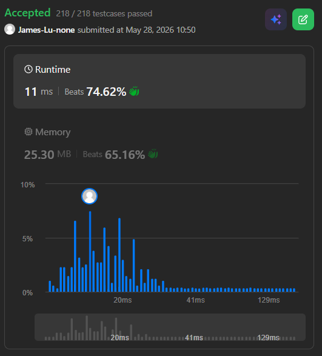

```c++
class Solution {
public:
    int numDecodings(string s) {
        // problem: numbers of ways to decode s
        // subproblem: numbers of ways to decode s[0..i-1] (prefix of length i)
        // dp table: dp[i] stores the number of decoding ways for the prefix of length i

        int n = s.length();
        if (n == 0 || s[0] == '0') {
            return 0;
        }
        
        // base case: dp[0] is 1 (select nothing), dp[1] is 9 if s[0] is '*' otherwise 1
        vector<long long> dp(n + 1, 0);
        dp[0] = 1;
        dp[1] = (s[0] == '*') ? 9 : 1;

        // bottom up method
        for (int i = 2; i <= n; i++) {
            char first = s[i - 2];
            char second = s[i - 1];

            // For dp[i-1]
            if (second == '*') {
                dp[i] += 9 * dp[i - 1];
            } else if (second > '0') {
                dp[i] += dp[i - 1];
            }
            
            // For dp[i-2]
            if (first == '*') {
                if (second == '*') {
                    dp[i] += 15 * dp[i - 2];
                } else if (second <= '6') {
                    dp[i] += 2 * dp[i - 2];
                } else {
                    dp[i] += dp[i - 2];
                }
            } else if (first == '1' || first == '2') {
                if (second == '*') {
                    if (first == '1') {
                       dp[i] += 9 * dp[i - 2]; 
                    } else { // first == '2'
                       dp[i] += 6 * dp[i - 2]; 
                    }
                } else if (((first - '0') * 10 + (second - '0')) <= 26) {
                    dp[i] += dp[i - 2];    
                }
            }

            dp[i] %= 1000000007;
        }
        
        return dp[n];
    }
};
```
