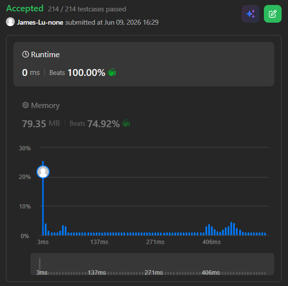

```c++
class Solution {
public:
    int maxProfit(vector<int>& prices) {
        // scan prices and continuously update the best possible value of
        // buy1/buy2: max money we remain at the moment
        // sell1/sell2: max profit we can get at the moment
        int buy1 = INT_MIN;
        int sell1 = 0;
        int buy2 = INT_MIN;
        int sell2 = 0;
        for(int p:prices) {
            // keep previous first buy or buy today (profit -p)
            buy1 = max(buy1, -p);
            // keep previous first sell or sell today (using buy1 from past or today)
            // sell1/2 keeps 0 if the stock price keeps dropping (not buying at all)
            sell1 = max(sell1, p + buy1);

            // keep previous second buy or use profit from first transaction and buy again
            // we have to consider sell1 since you must sell the stock before you buy again 
            buy2 = max(buy2, sell1 - p);
            // keep previous second sell or sell today instead
            sell2 = max(sell2, p + buy2);
        }
        // after processing all prices, sell2 represents the max profit achievable with at most two transactions
        return sell2;
    }
};
```
