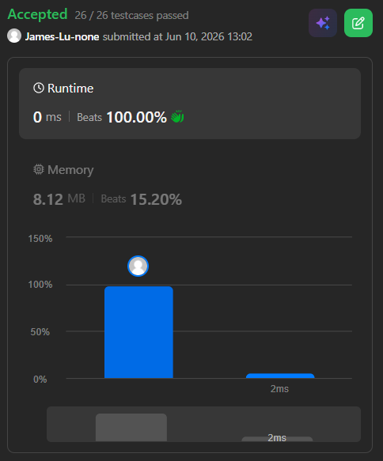

```c++
class Solution {
public:
    int poorPigs(int buckets, int minutesToDie, int minutesToTest) {
        // With 2 pigs, poison killing in 15 minutes, and having 60 minutes
        // we can find the poison in up to 25 buckets in the following way.
        // Arrange the buckets in a 5×5 square:
        //  1  2  3  4  5
        //  6  7  8  9 10
        // 11 12 13 14 15
        // 16 17 18 19 20
        // 21 22 23 24 25
        // now use one pig to find the row (drink 1, 2, 3, 4, 5, wait 15 minutes, drink 6, 7, 8, 9, 10, wait 15 minutes...)
        // and use the second pig to find the column
        // If the row pig dies in the nth test, the poison is in the nth row, same for column pig
        // if neither died, the poison bucket is at fifth column/row (this is why we can cover five rows/columns with four tests)
        // so with 3 pigs with 60 mins, we can solve for another dim, up to 5x5x5=125 bucket
        // so with k=floor(minToTest/minToDie) tests, we can determine up to (k+1)^n buckets with n pigs
        // its k+1 not k here since there's an additional state that a pig can determine without testing, that is, the case that the pig doesn't die after k tests

        int k = minutesToTest/minutesToDie;
        int n = 0;
        while (pow(k+1, n)<buckets) {
            n++;
        }
        return n;
    }

    // // if we try to solve it with dp
    // int poorPigs(int buckets, int minutesToDie, int minutesToTest) {
    //     if (buckets == 1) return 0;
        
    //     int rounds = minutesToTest / minutesToDie;

    //     // bucket <= 1000, and with only one round, the maximum pig needed is 10 pigs (1+1)^10=1024>1000
    //     // dp[i][j] means the maximum bucket that poisonous one can be figured out with i pigs j tests
    //     vector<vector<int>> dp(11, vector<int>(rounds+1, 0));
        
    //     // base cases
    //     for (int j = 0; j <= rounds; j++) dp[0][j] = 1; // with 0 pigs, we can only determine 1 bucket nomatter how many rounds we have
    //     for (int i = 0; i <= 10; i++) dp[i][0] = 1; // with 0 tests,  we can only determine 1 bucket nomatter how many pigs we have
        
    //     // bottom up dp
    //     for (int i = 1; i <= 10; i++) {
    //         for (int j = 1; j <= rounds; j++) {
    //             // everytime a big is added, the maximum bucket we can verify times (rounds + 1)
    //             dp[i][j] = dp[i - 1][j] * (j + 1);
    //         }
            
    //         if (dp[i][rounds] >= buckets) {
    //             return i;
    //         }
    //     }
        
    //     return 10;
    // }
};
```
