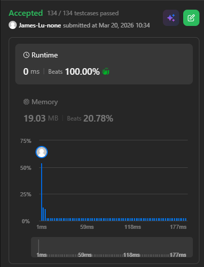

```c++
/**
 * Definition for singly-linked list.
 * struct ListNode {
 *     int val;
 *     ListNode *next;
 *     ListNode() : val(0), next(nullptr) {}
 *     ListNode(int x) : val(x), next(nullptr) {}
 *     ListNode(int x, ListNode *next) : val(x), next(next) {}
 * };
 */
class Solution {
public:
    ListNode* mergeSort(ListNode* left, ListNode* right){
        ListNode a(0);
        ListNode* head=&a;
        ListNode* tail=head;
        while(left && right){
            if (left->val < right->val) {
                tail->next = left;
                left = left->next;
            } else {
                tail->next = right;
                right = right->next;
            }
            tail = tail->next;
        }
        if (right) tail->next = right;
        if (left) tail->next = left;
        return head->next;
    }
    ListNode* mergeKLists(vector<ListNode*>& lists) {
         // int res[];
        vector<int>res;
        for(int i=0;i<lists.size();i++){
            ListNode *temp=lists[i];
            while(temp){
                res.push_back(temp->val);
                temp=temp->next;
            }
        } 
        sort(res.begin(), res.end());
        if(res.empty()) return nullptr;
        ListNode* head = new ListNode(res[0]);
        ListNode* tail = head;
        for(int i=1;i<res.size();i++){
            tail->next = new ListNode(res[i]);
            tail=tail->next;
        }
        return head;
        // // following solution has Time: 15 ms (18.91%) | Memory: 32.1 MB (5.41%) :(
        // int n = lists.size();
        // if (n == 0) return nullptr;
        // if (n == 1) return lists[0];

        // auto begin = lists.begin();
        // auto end = lists.end();
        // auto mid = begin + n/2;
        // vector<ListNode*> leftLists(begin, mid);
        // vector<ListNode*> rightLists(mid, end);

        // ListNode* leftMerged = mergeKLists(leftLists);
        // ListNode* rightMerged = mergeKLists(rightLists);
        // return mergeSort(leftMerged, rightMerged);
    }
};
```
