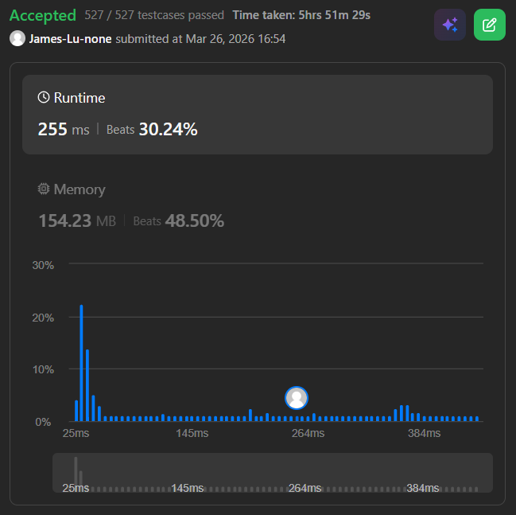

```c++
class Solution {
    // 每個節點儲存四種邊界選取狀態的結果
    struct Node {
        long long s[2][2];
        Node() {
            for (int i = 0; i < 2; i++)
                for (int j = 0; j < 2; j++)
                    s[i][j] = -1e18;
        }
    };

    vector<Node> tree;
    int n;
    const long long mod = 1e9 + 7;

    void pull(int v) {
        int L = v * 2, R = v * 2 + 1;
        // 在節點v區間([L,R]) 不選最左端點、不選最右端點 的元素會有以下幾種選法
        // case 1: L.s[0][0]: 不選左端點、不選右端點 的子序列和(對於葉節點來說就是甚麼都不選，回傳0) + R.s[0][0]: 不選左端點、不選右端點 的子序列和(對於葉節點來說就是甚麼都不選，回傳0)
        // case 2: L.s[0][1]: 不選左端點、要選右端點 的子序列和(對於葉節點來說不能這樣選，回傳 -inf) + R.s[0][0]: 不選左端點、不選右端點 的子序列和(對於葉節點來說就是甚麼都不選，回傳0)
        // case 3: L.s[0][0]: 不選左端點、不選右端點 的子序列和(對於葉節點來說就是甚麼都不選，回傳0) + R.s[1][0]: 要選左端點、不選右端點 的子序列和(對於葉節點來說不能這樣選，回傳-inf)
        // case 4: L.s[0][1]: 不選左端點、要選右端點 的子序列和(對於葉節點來說就是甚麼都不選，回傳0) + R.s[1][0]: 要選左端點、不選右端點 的子序列和(對於葉節點來說就是甚麼都不選，回傳0)
        // 其中case 4違反了 "不能選相鄰節點" 的規則，所以在節點v區間([L,R]) 不選最左端點、不選最右端點 的元素所得到的"最大"序列和就是 case 1, case 2, case 3 的最大值
        tree[v].s[0][0] = max({tree[L].s[0][0] + tree[R].s[0][0], 
                               tree[L].s[0][1] + tree[R].s[0][0], 
                               tree[L].s[0][0] + tree[R].s[1][0]});

        // 在節點v區間([L,R]) 不選最左端點、要選最右端點 的元素會有以下幾種選法
        // case 1: L.s[0][0]: 不選左端點、不選右端點 的子序列和 + R.s[0][1]: 不選左端點、要選右端點 的子序列和
        // case 2: L.s[0][1]: 不選左端點、要選右端點 的子序列和 + R.s[0][1]: 不選左端點、不選右端點 的子序列和
        // case 3: L.s[0][0]: 不選左端點、不選右端點 的子序列和 + R.s[1][1]: 要選左端點、不選右端點 的子序列和
        // case 4: L.s[0][1]: 不選左端點、要選右端點 的子序列和 + R.s[1][1]: 要選左端點、不選右端點 的子序列和 x
        // 其中case 4違反了 "不能選相鄰節點" 的規則，所以在節點v區間([L,R]) 不選最左端點、要選最右端點 的元素所得到的"最大"序列和就是 case 1, case 2, case 3 的最大值
        tree[v].s[0][1] = max({tree[L].s[0][0] + tree[R].s[0][1], 
                               tree[L].s[0][1] + tree[R].s[0][1], 
                               tree[L].s[0][0] + tree[R].s[1][1]});

        // 同上邏輯
        tree[v].s[1][0] = max({tree[L].s[1][0] + tree[R].s[0][0], 
                               tree[L].s[1][1] + tree[R].s[0][0], 
                               tree[L].s[1][0] + tree[R].s[1][0]});
        // 同上邏輯
        tree[v].s[1][1] = max({tree[L].s[1][0] + tree[R].s[0][1], 
                               tree[L].s[1][1] + tree[R].s[0][1], 
                               tree[L].s[1][0] + tree[R].s[1][1]});
        
        // 上面每一個中間相鄰部分都是四種可能
        // 0 0
        // 0 1
        // 1 0
        // 1 1 違反了 "不能選相鄰節點" 的規則
    }

    void build(const vector<int>& nums, int v, int tl, int tr) {
        if (tl == tr) {
            tree[v].s[0][0] = 0;
            // 原本是 tree[v].s[1][1] = nums[tl] ，但負數可以不選，所以如果有負數直接當0
            tree[v].s[1][1] = max(0, nums[tl]);
            // 對於葉節點(只有一個數值的)來說，左節點就是右節點，所以 s[0][1] (選左邊但右邊不選) 和 s[1][0] (選右邊但左邊不選) 的選擇都不可能，維持 -1e18
            return;
        }
        int tm = (tl + tr) / 2;
        build(nums, v * 2, tl, tm);
        build(nums, v * 2 + 1, tm + 1, tr);
        pull(v);
    }

    void update(int v, int tl, int tr, int pos, int new_val) {
        if (tl == tr) {
            tree[v].s[0][0] = 0;
            tree[v].s[1][1] = max(0, new_val);
            return;
        }
        int tm = (tl + tr) / 2;
        if (pos <= tm)
            update(v * 2, tl, tm, pos, new_val);
        else
            update(v * 2 + 1, tm + 1, tr, pos, new_val);
        pull(v);
    }

public:
    int maximumSumSubsequence(vector<int>& nums, vector<vector<int>>& queries) {
        n = nums.size();
        int size = 2 * (1 << (int)ceil(log2(n)));
        tree.assign(size+1, Node());
        // add 1 since my segment tree is 1 indexed
        // 此處Segment tree 與 3721. Longest Balanced Subarray II (Hard) 的 Segment tree建構方式類似
        
        build(nums, 1, 0, n - 1);

        long long total_ans = 0;
        for (vector<int>& q : queries) {
            update(1, 0, n - 1, q[0], q[1]);
            
            // 根節點tree[1]的四種邊界選法中的最大值就是整個陣列的最大序列和
            long long cur_max = max({tree[1].s[0][0], tree[1].s[0][1], 
                                     tree[1].s[1][0], tree[1].s[1][1]});
            total_ans = (total_ans + cur_max) % mod;
        }

        return static_cast<int>(total_ans);
    }
};
```
