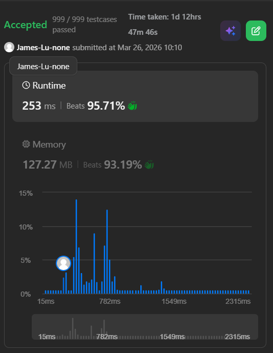

```c++
class Solution {
public:
    struct SegTree {
        int n;
        vector<int> sum, minSum, maxSum;

        SegTree(int _n) {
            n = _n;
            int size = 2 * (1 << (int)ceil(log2(n)));
            // printf("size = %d\n", size);
            // add 1 since my segment tree is 1 indexed
            sum.assign(size + 1, 0);
            minSum.assign(size + 1, 0);
            maxSum.assign(size + 1, 0);
        }
        void updateParent(int nodeIndex) {
            sum[nodeIndex] = sum[nodeIndex * 2] + sum[nodeIndex * 2 + 1];
            // since we want to find the first position where prefix sum is target, we want to know the minimum and maximum prefix sum in the subtree of current node, so we can decide whether we should go to left child or right child
            // note that its:
            // min(minSum[nodeIndex * 2], sum[nodeIndex * 2] + minSum[nodeIndex * 2 + 1]);
            // max(maxSum[nodeIndex * 2], sum[nodeIndex * 2] + maxSum[nodeIndex * 2 + 1]);
            // not:
            // min(minSum[nodeIndex * 2], minSum[nodeIndex * 2] + minSum[nodeIndex * 2 + 1]);
            // max(maxSum[nodeIndex * 2], maxSum[nodeIndex * 2] + maxSum[nodeIndex * 2 + 1]);
            // because when we go to right child, left child's is already done 
            minSum[nodeIndex] = min(minSum[nodeIndex * 2], sum[nodeIndex * 2] + minSum[nodeIndex * 2 + 1]);
            maxSum[nodeIndex] = max(maxSum[nodeIndex * 2], sum[nodeIndex * 2] + maxSum[nodeIndex * 2 + 1]);
        }
        // from top to bottom, update position pos to val
        void updateRecursive(int nodeIndex, int l, int r, int pos, int val) {
            if (l == r) {
                sum[nodeIndex] = val;
                minSum[nodeIndex] = min(0, val);
                maxSum[nodeIndex] = max(0, val);
                return;
            }
            int m = (l + r) / 2;
            if (pos <= m) updateRecursive(nodeIndex * 2, l, m, pos, val);
            else updateRecursive(nodeIndex * 2 + 1, m + 1, r, pos, val);

            // update current node's sum, minSum, maxSum based on its children (update
            // parent node's value based on its children)
            updateParent(nodeIndex);
        }

        // find the first position from 0 to n-1 where the prefix sum is target
        int query(int target) {
            // the first position to have prefix sum 0 is at index -1 (before the array even starts)
            if (target == 0) return -1;
            // if target is not even in between (max prefix sum, min prefix sum), then return a invalid index
            if (target < minSum[1] || target > maxSum[1]) return INT_MAX;
            // pref is used to track of skipped sum when we go to right child
            int pref = 0;
            return queryRecursive(1, 0, n - 1, target, pref);
        }

        int queryRecursive(int nodeIndex, int l, int r, int target, int &pref) {
            if (l == r) {
                if (pref + sum[nodeIndex] == target) return l;
                return n;
            }
            int m = (l + r) / 2;
            int L = nodeIndex * 2;
            int R = nodeIndex * 2 + 1;
            
            // if we went to right child, it means we skip the left child's contribution, so we need to add left child's sum to pref
            if (target >= pref + minSum[L] && target <= pref + maxSum[L]) {
                return queryRecursive(L, l, m, target, pref);
            } else {
                pref += sum[L];
                return queryRecursive(R, m + 1, r, target, pref);
            }
        }
    };
    int longestBalanced(vector<int>& nums) {
        int n = nums.size();
        SegTree st(n);
        int maxVal = INT_MIN;
        for (int val: nums) maxVal = max(maxVal, val);
        vector<int> lastPos(maxVal+1 ,-1);

        int ans = -1;
        int sum = 0;
        for (int i = 0; i < n; i++) {
            if (lastPos[nums[i]] == -1) {
                // prefixSum from 0 to i
                sum += (nums[i]%2==0)?1:-1;
            } else {
                // num[i] appears earlier in the array, we have to erase its contribution to prefix sum
                st.updateRecursive(1, 0, n-1, lastPos[nums[i]], 0);
            }
            lastPos[nums[i]] = i;
            st.updateRecursive(1, 0, n-1, i, (nums[i]%2==0)?1:-1);
            int p = st.query(sum);
            ans = max(i-p, ans);
        }
        return ans;
    }
};
```
