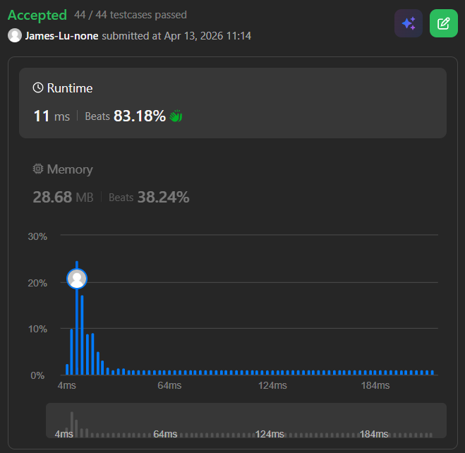

```c++
class Solution {
public:
    vector<vector<int>> getSkyline(vector<vector<int>>& buildings) {
        vector<vector<int>> ans;
        // using multiset here since priority queue doesn't support find by value
        multiset<int> pq{0};
        vector<pair<int, int>> points;
        
        // push {x, height} pair into points, but for start point, push with height*-1
        // for end point push with height, with this vector we can know when to add or remove building from pq
        // ex: [[0,2,3],[2,5,3]]
        // -> [[0,-3],[2,3],[2,-3],[5,3]]
        for(auto b: buildings){
            points.push_back({b[0], -b[2]});
            points.push_back({b[1], b[2]});
        }
        // sort all points ascendingly, first compare x, if x are the same, compare height
        // ex: [[0,-3],[2,3],[2,-3],[5,3]] 
        // ->  [[0,-3],[2,-3],[2,3],[5,3]] -> ["insert 3", "insert 3", "erase 3", "erase 3"] -> smooth roof line at x=2
        // here shows the reasone why we push height*-1 for start point and push height for end point is because
        // if we do the opposite, the sorting will have two changes in height
        // ex: [[0,3],[2,-3],[2,3],[5,-3]] 
        // ->  [[0,3],[2,-3],[2,3],[5,-3]] -> ["insert 3", "erase 3", "insert 3", "erase 3"] -> splik roof line at x=2 (wrong)
        sort(points.begin(), points.end());
        
        int ongoingHeight = 0;
        
        // points.first = x coordinate, points.second = height
        for(int i = 0; i < points.size(); i++){
            int currentPoint = points[i].first;
            int heightAtCurrentPoint = points[i].second;
            
            if(heightAtCurrentPoint < 0){
                // add the building from multiset when reaches start
                pq.insert(-heightAtCurrentPoint);
            } else {
                // remove the building from multiset when reaches end
                pq.erase(pq.find(heightAtCurrentPoint));
            }

            // get last (largest) element from multiset
            auto highestHeight = *pq.rbegin();
            // if highestHeight is different from ongoingHeight, then update ongoingHeight and add {currentPoint, ongoingHeight} to ans
            if (ongoingHeight != highestHeight) {
                ongoingHeight = highestHeight;
                ans.push_back({currentPoint, ongoingHeight});
            }
        }
        
        return ans;
    }
};
```
