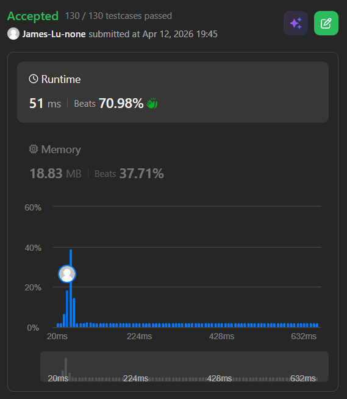

```c++
class Solution {
public:
    // staircase O(n+m)
    bool searchMatrix(vector<vector<int>>& matrix, int target) {
        int rows = matrix.size();
        int cols = matrix[0].size();
        // start at top right
        int c = cols - 1;
        int r = 0;
        while (c >= 0 && r < rows) {
            if (matrix[r][c] == target) return true;
            else if (matrix[r][c] > target) c--;
            else r++;
        }
        return false;
    }
    // // divide and conquer a = 3, b = 4 O((nxm)^0.79)
    // bool ans;
    // void searchRecursive(vector<vector<int>>& matrix, int rowLow, int rowHigh, int colLow, int colHigh, int target) {
    //     // printf("rowLow: %d, rowHigh: %d, colLow: %d, colHigh: %d \n", rowLow, rowHigh, colLow, colHigh);
    //     if (rowHigh <= rowLow || colHigh <= colLow || ans) return;
    //     int rowMid = rowLow + (rowHigh-rowLow)/2;
    //     int colMid = colLow + (colHigh-colLow)/2;
    //     // printf("row: %d, col: %d\n", rowMid, colMid);
    //     // printf("%d\n", matrix[rowMid][colMid]);
    //     if (matrix[rowMid][colMid] == target) {
    //         ans = true;
    //     }
    //     else if (matrix[rowMid][colMid] > target) {
    //         searchRecursive(matrix, rowLow, rowMid, colLow, colHigh, target); // above current (include current)
    //         searchRecursive(matrix, rowMid, rowHigh, colLow, colMid, target); // bottom left (include current)
    //     }
    //     else {
    //         searchRecursive(matrix, rowMid + 1, rowHigh, colLow, colHigh, target); // below current (exclude current)
    //         searchRecursive(matrix, rowLow, rowMid + 1, colMid + 1, colHigh, target); // upper right (exclude current)
    //     }
    //     return;
    // }
    // bool searchMatrix(vector<vector<int>>& matrix, int target) {
    //     if (matrix.empty() || matrix[0].empty()) return false;
    //     ans = false;
    //     searchRecursive(matrix, 0, matrix.size(), 0, matrix[0].size(), target);
    //     return ans;
    // }
};
```
