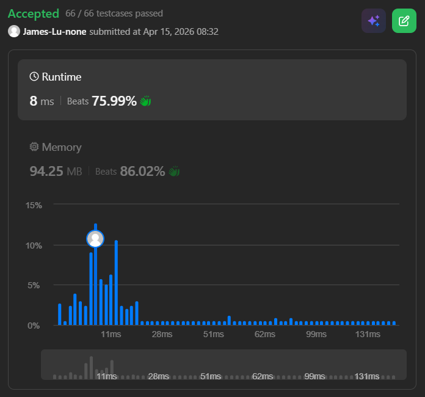

```c++
class Solution {
public:
    int findMaxValueOfEquation(vector<vector<int>>& points, int k) {
        deque<int> dq;
        int ans = INT_MIN;
        int n = points.size();
        
        for (int j=0;j<n;j++) {
            int xj = points[j][0];
            int yj = points[j][1];
            while (!dq.empty() && xj - points[dq.back()][0] > k) {
                dq.pop_back();
            }
            // we can confirm that last point in the dq has largest y-x here since we removes all the front points that is smaller
            if (!dq.empty()) {
                int i = dq.back();
                ans = max(ans, points[i][1]-points[i][0]+xj+yj);
            }

            // pops all the front points if it is less or equal to current y-x,
            // since any less or equal value to this in the dq means that it will never be the best choice
            // points=[[-14,1], [-13,-18],[-12,18],[-7,12]], k=6
            // 1. when j=2, dq: front->[1, 0]<-back, currentVal y-x will be 18-(-12)=30,
            // which is larger then yi-xi at all dq.front(), so 1 and 0 was popped out => dq: front->[]<-back, and j=2 is push_front to dq => dq: front->[2]<-back
            // 2. when j=3, dq: front->[2]<-back, we can calculate the maximum safely with dq.back(), and get Max Value of Equation at j=3, i=2
            int currentVal = yj - xj;
            while (!dq.empty() && (points[dq.front()][1] - points[dq.front()][0]) <= currentVal) {
                // printf("pops: [%d, %d]\n",points[dq.front()][1], points[dq.front()][0]);
                dq.pop_front();
            }

            dq.push_front(j);
        }
        return ans;
    }

    // // TLE
    // struct Pair {
    //     int index;
    //     // store yi-xi
    //     int value;
    //     Pair(int i, int v): index(i), value(v) {}
    //     bool operator<(const Pair& other) const {
    //         return value < other.value;
    //     }
    // };
    // int findMaxValueOfEquation(vector<vector<int>>& points, int k) {
    //     priority_queue<Pair, vector<Pair>, less<Pair>> pq;
    //     int n = points.size();
    //     for (int i=0;i<n;i++) {
    //         pq.emplace(points[i][0], points[i][1]-points[i][0]);
    //     }
    //     int ans = INT_MIN;
    //     for (int j=0;j<n;j++) {
    //         priority_queue<Pair, vector<Pair>, less<Pair>> pqTemp = pq;
    //         int xj = points[j][0];
    //         int yj = points[j][1];
    //         printf("xj = %d, yj = %d\n", xj, yj);
    //         while (!pqTemp.empty()) {
    //             auto top = pqTemp.top();
    //             if (top.index - xj <= k && xj - top.index <= k && top.index != xj) {
    //                 printf("found valid: xi = %d, value = %d\n", top.index, top.value);
    //                 ans = max(ans, top.value + xj + yj);
    //             }
    //             pqTemp.pop();
    //         }
    //     }
    //     return ans;
    // }
};
```
