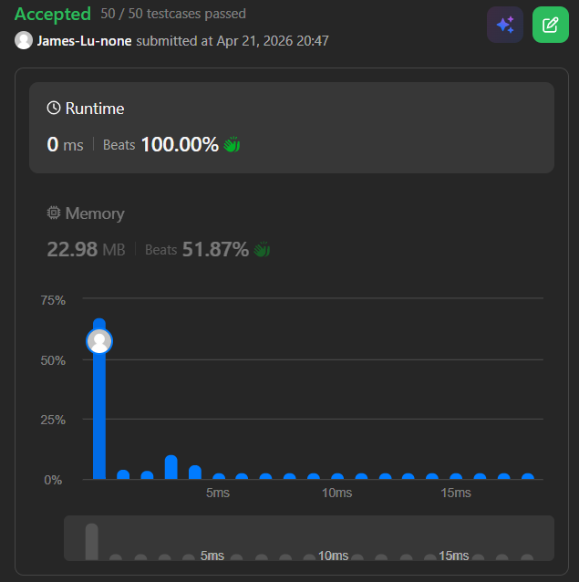

```c++
class Solution {
public:
    int candy(vector<int>& ratings) {
        // scan from left:  [60, 80, 100, 80, 100, 100] -> [1, 2, 3, 1, 2, 1]
        // scan from right: [60, 80, 100, 80, 100, 100] -> [1, 1, 2, 1, 1, 1]
        // total (max):                                    [1, 2, 3, 1, 2, 1]

        int n = ratings.size();
        vector<int> candies(n, 1);

        // First pass: left to right
        for (int i = 1; i < n; i++) {
            if (ratings[i] > ratings[i-1]) {
                candies[i] = candies[i-1] + 1;
            }
        }

        // Second pass: right to left
        for (int i = n - 2; i >= 0; i--) {
            if (ratings[i] > ratings[i+1]) {
                // Ensure both left and right conditions are met
                candies[i] = max(candies[i], candies[i+1] + 1);
            }
        }

        // Sum up the candies
        int total = 0;
        for (int c : candies) total += c;
        return total;
    }
};
```
