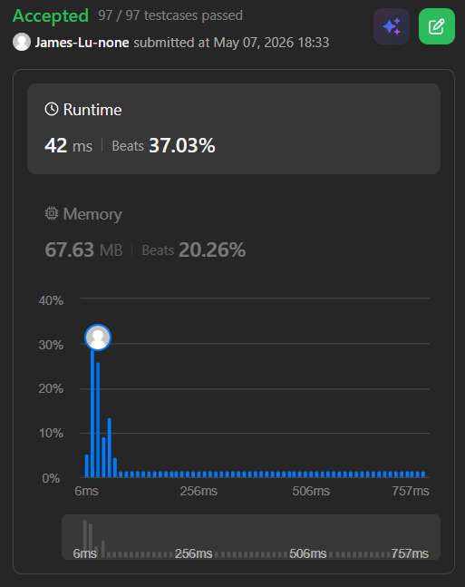

```c++
class Solution {
public:
    int scheduleCourse(vector<vector<int>>& courses) {
        // [[100,200],[200,1300],[1000,1250],[2000,3200]]
        // init currDay = 0
        // naive thought: greedily take classes that has smallist diff value: lastDay-currDay
        // so it will take:
        // courses[0] (diff: 200-0=200), currDay = 0+100 = 100 <= 200
        // -> courses[2] (diff: 1250-100=1150), currDay = 100+1000 = 1100 <= 1250
        // -> courses[1] (diff: 1300-1100=200), currDay = 1100+200 = 1300 <= 1300
        // -> courses[4] (diff: 3200-1300=900), currDay = 1300+2000 = 3300 > 3200, so not allowed
        // but it will fail for case [[100, 110],[10, 111]], it will pick courses[0] first, 

        // sort courses based on second element, so we can take classes that has smaller end date first
        sort(courses.begin(), courses.end(), [](const vector<int>& a, const vector<int>& b) {
            return a[1] < b[1];
        });

        // // max heap that store the course duration
        priority_queue<int> pq;

        int currDay=0;
        for (auto c: courses) {
            int duration = c[0];
            int lastDay = c[1];
            // printf("lastDay: %d \n", lastDay);

            if (currDay + duration <= lastDay) {
                // printf("added: %d \n", duration);
                pq.push(duration);
                currDay += duration;
            } else if(!pq.empty() && duration < pq.top()) {
                currDay -= pq.top();
                pq.pop();
                // printf("pop: %d \n", longestDuration);

                currDay += duration;
                pq.push(duration);
            }
        }
        return pq.size();
    }
};
```
