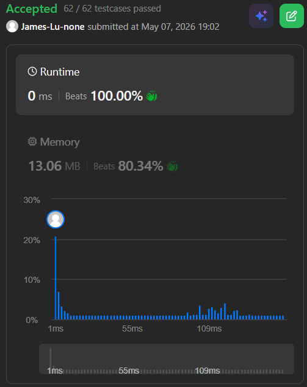

```c++
class Solution {
public:
    int partitionString(string s) {
        int n = s.length();
        int left = 0;
        int ans = 0;
        while(left<n) {
            string tmp;
            for (int i=left; i<n; i++) {
                if (!tmp.contains(s[i])){
                    tmp.push_back(s[i]);
                    left = i+1;
                } else{
                    break;
                }
            }
            ans++;
        }
        return ans;
    }
};
```
